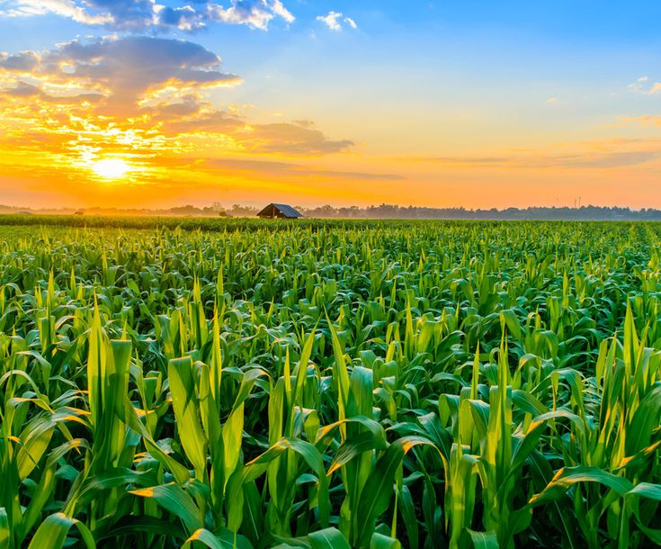

# 🌱 SmartCrop Advisory

A web-based **Smart Crop Advisory System** designed to help farmers make better agricultural decisions using information related to crops, soil, pests, weather, market prices, and government schemes.

The project provides a simple and user-friendly interface to access useful agricultural information in one place.

---

## ✨ Features

* 🌾 Crop-related advisory information
* 🌱 Soil-related information
* 🐛 Pest and disease information
* 🌦️ Weather information
* 💰 Market price information
* 🏛️ Government scheme information
* 📱 Simple and responsive user interface
* 🧑‍🌾 Farmer-friendly design
* 🎨 Clean and easy-to-use dashboard

---

## 🛠️ Tech Stack

* HTML5
* CSS3
* JavaScript
* Git & GitHub

---
## 📸 Demo Screenshots

### 🏠 Home Page



### 🌱 Soil Advisory


### 🐛 Pest Advisory


### 🌦️ Weather Information


### 💰 Market Prices


### 🏛️ Government Schemes


## 📂 Project Structure

```text
SmartCrop-Advisory/
│
├── index.html
├── style.css
├── script.js
│
├── field.jpeg
├── soil.jpeg
├── pests.jpeg
├── weather.jpeg
├── price.jpeg
├── scheme.jpeg
│
├── output/
│
└── README.md
```

---

## 🚀 Getting Started

### 1. Clone the repository

```bash
git clone https://github.com/priyanshisingh0210/SmartCrop-Advisory.git
```

### 2. Open the project folder

```bash
cd SmartCrop-Advisory
```

### 3. Run the project

Open `index.html` in your browser.

---

## 🎯 Project Objective

The objective of SmartCrop Advisory is to provide farmers with useful agricultural information through a simple web-based platform.

The project brings different types of agricultural information together in one place, helping users access crop, soil, pest, weather, market, and government scheme information more easily.

---

## 🔮 Future Improvements

* 🤖 AI-based crop recommendations
* 🦠 Automated crop disease detection
* 🌐 Multi-language support
* 🎙️ Voice-based interaction
* 📍 Location-based weather information
* 📊 Personalized crop recommendations
* 🔗 Integration with real-time agricultural APIs
* 📱 Progressive Web App support

---

## 👩‍💻 Author

**Priyanshi Singh**

* GitHub: https://github.com/priyanshisingh0210
* LinkedIn: https://www.linkedin.com/in/priyanshi-singh-8b4158313

---

## ⭐ Show Your Support

If you found this project useful, consider giving the repository a ⭐ on GitHub.
# SmartCrop-Advisory
